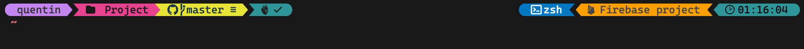

# Omp_firebase_prompt
Show current firebase project on custom oh-my-posh theme

This repository provides a zsh script and a custom oh-my-posh theme that displays the current firebase project as in the following example: 




## How to set up

### Macos

Create folder `.ohmyposh` in you home folder `~/`

Copy the contents or move the `.firebase.omp.json` and `.firebase_project.zsh` files to the newly created folder.

The script needs the jq dependency to parse the json, so it must be installed. Here's the command via homebrew

``` 
brew install jq
```

### Windows

*Work in progress* 


## More info

The theme is a fork of the `cloud-native-azure` from the official oh-my-posh repository.

The project was made quickly for my own needs, it has not been tested much in several environments, do not hesitate to give your feedback. 

This project is meant to be temporary until someone creates the official firebase segment. If you're a Go developer, don't hesitate 😜